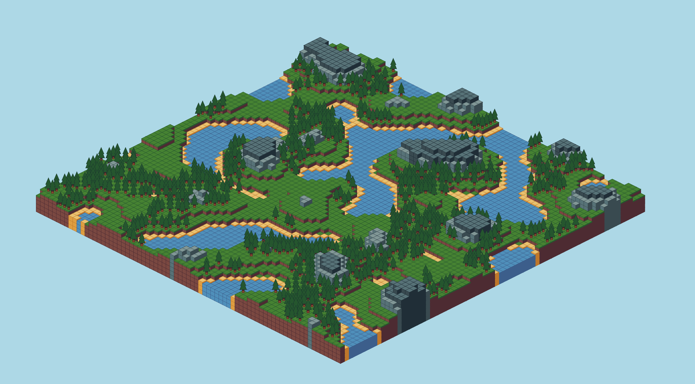

# Javascript Terrain Generation
* Very simple terrain generation engine on an isometric voxel based grid
* Rendered using JS canvas
* Pretty much entirely ported from [my python version](https://github.com/m-kubes/TurtlePy-Terrain-Generation) plus some other stuff
* Runs much better than the python version
